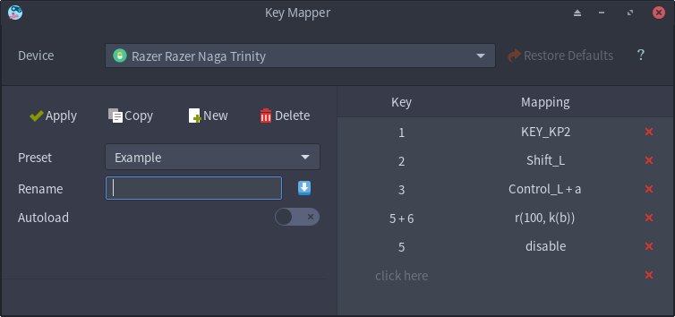

<p align="center"></p>

<h1 align="center">Key Mapper</h1>

<p align="center">
  An easy to use tool to change the mapping of your input device buttons.<br/>
  Supports mice, keyboards, gamepads, X11, Wayland, combined buttons and programmable macros.
</p>

<p align="center"><a href="readme/usage.md">Usage</a> - <a href="#installation">Installation</a> - <a href="readme/development.md">Development</a> - <a href="#screenshots">Screenshots</a></p>

<p align="center"> </p>

## Installation

##### Manjaro/Arch

```bash
pacaur -S key-mapper-git
```

##### Ubuntu/Debian

Get a .deb file from the [release page](https://github.com/sezanzeb/key-mapper/releases)
or install the latest changes via:

```bash
sudo apt install git python3-setuptools
git clone https://github.com/sezanzeb/key-mapper.git
cd key-mapper; ./scripts/build.sh
sudo apt install ./dist/key-mapper-0.7.1.deb
```

##### pip

```bash
sudo pip install git+https://github.com/sezanzeb/key-mapper.git
sudo systemctl enable key-mapper
sudo systemctl restart key-mapper
```

## Screenshots

<p align="center">
  
</p>

<p align="center">
  
</p>
