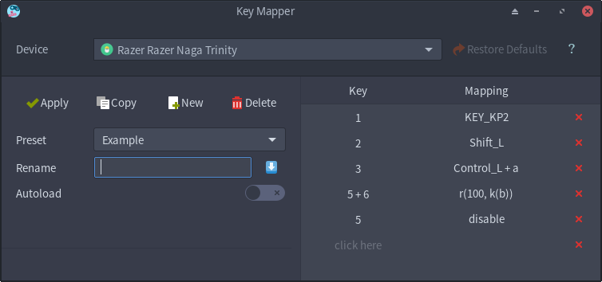
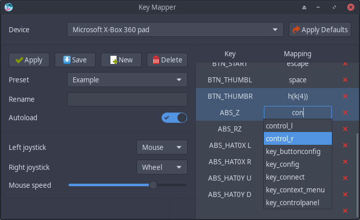

<p align="center"></p>

<h1 align="center">Input Remapper</h1>

<p align="center">
  An easy to use tool for Linux to change the behaviour of your input devices.<br/>
  Supports X11, Wayland, combinations, programmable macros, joysticks, wheels,<br/>
  triggers, keys, mouse-movements and more. Maps any input to any other input.
</p>

<p align="center"><a href="readme/usage.md">Usage</a> - <a href="readme/macros.md">Macros</a> - <a href="#installation">Installation</a> - <a href="readme/development.md">Development</a> - <a href="readme/examples.md">Examples</a></p>

<p align="center"> </p>


<p align="center">
  
  &#160;
  
</p>

<br/>

## Installation

### Ubuntu/Debian

Either download an installable .deb file from the [latest release](https://github.com/sezanzeb/input-remapper/releases):

```sh
wget https://github.com/sezanzeb/input-remapper/releases/download/2.2.1/input-remapper-2.2.1.deb
sudo apt install -f ./input-remapper-2.2.1.deb
```

Or install the very latest changes via:

```sh
sudo apt install git gettext
git clone https://github.com/sezanzeb/input-remapper.git
cd input-remapper
./scripts/build-deb.sh
sudo apt purge input-remapper input-remapper-daemon input-remapper-gtk python3-inputremapper
sudo apt install -f ./dist/input-remapper-2.2.1.deb
```

Input Remapper is also available in the repositories of [Debian](https://tracker.debian.org/pkg/input-remapper)
and [Ubuntu](https://packages.ubuntu.com/oracular/input-remapper) via

```sh
sudo apt install input-remapper
```

Input Remapper ≥ 2.0 requires at least Ubuntu 22.04.

<br/>

### Fedora

```sh
sudo dnf install input-remapper
sudo systemctl enable --now input-remapper
```

<br/>

### Arch

```sh
yay -S input-remapper-git
sudo systemctl enable --now input-remapper
```

<br/>

### Void

```sh
sudo xbps-install -S input-remapper
sudo ln -s /etc/sv/input-remapper /var/service
sudo sv up input-remapper
```

<br/>

### Other Distros

Figure out the packages providing those dependencies in your distro, and install them:
`python3-evdev` ≥1.3.0, `gtksourceview4`, `python3-devel`, `python3-pydantic`,
`python3-dasbus`, `python3-psutil`

You can also use pip to install some of them. Python packages need to be installed
globally for the service to be able to import them. Don't use `--user`. Conda and such
may also cause problems due to changed python paths and versions.

```sh
sudo pip install evdev pydantic dasbus PyGObject
```

```sh
git clone https://github.com/sezanzeb/input-remapper.git
cd input-remapper
sudo python3 -m install --root /
sudo systemctl enable --now input-remapper
```

For all other options and help, check `python3 -m install --help`

To uninstall:

```sh
sudo python3 -m install.uninstall
```


## 🌐 Web Resources & Interactive Index
- [MERGE BRAINROT 2](https://themindzone.pages.dev/merge-brainrot-2.html)
- [MINI SHOOTERS](https://quizverses.github.io/mini-shooters.html)
- [POP THE BUBBLE](https://studyquests.github.io/pop-the-bubble.html)
- [CLEAN THE FLOOR](https://quizverses-9d2f2.web.app/clean-the-floor.html)
- [BLANKETS](https://studyplaying.github.io/blankets.html)
- [CATEGORY FLASH 2](https://studyquesthub.web.app/category-flash-2.html)
- [CATEGORY CASUAL 8](https://quizverses.pages.dev/category-casual-8.html)
- [COLOR SAND PUZZLE](https://studyquests.github.io/color-sand-puzzle.html)
- [CATEGORY SOCCER60](https://studyquests.github.io/category-soccer60.html)
- [CATEGORY ARENA254](https://studyquests.github.io/category-arena254.html)
- [AVATAR MASTER FIX UP FACE](https://learnquester.github.io/avatar-master-fix-up-face.html)
- [CATEGORY DIRT BIKE18](https://quizverses.github.io/category-dirt-bike18.html)
- [SPRUNKI BEATS](https://studyquests.pages.dev/sprunki-beats.html)
- [CATEGORY PREMIUM PERKS71](https://quizverses-9d2f2.web.app/category-premium-perks71.html)
- [COSMIC TETRIZ PUZZLES](https://studyplaying.github.io/cosmic-tetriz-puzzles.html)
- [CATEGORY CUTE](https://studyplaying.github.io/category-cute.html)
- [CATEGORY MONSTER](https://studyquests.github.io/category-monster.html)
- [HEADLEG DASH PARKOUR](https://learnquester.github.io/headleg-dash-parkour.html)
- [THE SORT AGENCY](https://quizverses.pages.dev/the-sort-agency.html)
- [ON FIRE BASKETBALL SHOTS](https://studyplayings.pages.dev/on-fire-basketball-shots.html)
- [OFFICE SPIDER SOLITAIRE](https://studyquesthub.web.app/office-spider-solitaire.html)
- [GEOMETRY ARROW 2](https://quizverses-9d2f2.web.app/geometry-arrow-2.html)
- [POPCATS MERGE THE CATS](https://quizverses.github.io/popcats-merge-the-cats.html)
- [CATEGORY HORROR](https://quizverses.github.io/category-horror.html)
- [THUMBPINBALL](https://studyplayings.pages.dev/thumbpinball.html)
- [UNSCREW WOOD PUZZLE](https://quizverses-9d2f2.web.app/unscrew-wood-puzzle.html)
- [FIGHTER STICK HERO](https://quizverses.pages.dev/fighter-stick-hero.html)
- [STOP THE BULLET](https://studyplayings.pages.dev/stop-the-bullet.html)
- [KAWAII CLAW MERGE](https://quizverses.pages.dev/kawaii-claw-merge.html)
- [FORTRESS OF THE SINISTER](https://learnquester.github.io/fortress-of-the-sinister.html)
- [EGG ADVENTURE MIRROR WORLD](https://learnquester.github.io/egg-adventure-mirror-world.html)
- [CATEGORY SOLDIER](https://studyquests.github.io/category-soldier.html)
- [CATEGORY CRAFTING45](https://quizverses-9d2f2.web.app/category-crafting45.html)
- [RAMP CAR JUMPING](https://quizverses.pages.dev/ramp-car-jumping.html)
- [DONUT RUN](https://thelearnquester.web.app/donut-run.html)
- [CATEGORY HUNTING16](https://quizverses.github.io/category-hunting16.html)
- [CATEGORY LOL41](https://studyplayings.web.app/category-lol41.html)
- [CATEGORY DEFENSE](https://quizverses.github.io/category-defense.html)
- [HEROES OF THE ARENA](https://studyquests.pages.dev/heroes-of-the-arena.html)
- [MOJO EMOJI](https://studyquests.pages.dev/mojo-emoji.html)
- [VEGAMIX DA VINCI PUZZLES](https://studyplayings.web.app/vegamix-da-vinci-puzzles.html)
- [CATEGORY COLLECT565](https://studyquests.pages.dev/category-collect565.html)
- [CATEGORY SOCCER](https://studyplayings.web.app/category-soccer.html)
- [CATEGORY CASUAL 8](https://learnquester.github.io/category-casual-8.html)
- [SUPERMARKET SORT N MATCH](https://studyquests.github.io/supermarket-sort-n-match.html)
- [CATEGORY COLLECT](https://studyquests.pages.dev/category-collect.html)
- [CATEGORY HORROR 2](https://themindplay.github.io/category-horror-2.html)
- [SWEET BUSINESS OF CATS CAKES](https://theskillquest.pages.dev/sweet-business-of-cats-cakes.html)
- [CATEGORY FREE RAGDOLL GAMES](https://theskillquest.pages.dev/category-free-ragdoll-games.html)
- [CATEGORY SANDBOX40](https://studyquests.github.io/category-sandbox40.html)
- [ALOHA MAHJONG](https://themindzone.pages.dev/aloha-mahjong.html)
- [POGO MASTERS](https://quizverses-9d2f2.web.app/pogo-masters.html)
- [BALL BUNKER SNEAKY STACKS](https://theskillquest.pages.dev/ball-bunker-sneaky-stacks.html)
- [CATEGORY FASHION105](https://theskillquest.pages.dev/category-fashion105.html)
- [FUN GOLF](https://theskillquest.pages.dev/fun-golf.html)
- [CATEGORY 3D1 371](https://theskillquest.pages.dev/category-3d1-371.html)
- [HERO FIGHT CLASH](https://theskillquest.pages.dev/hero-fight-clash.html)
- [TAP IT AWAY 3D](https://themindzone.pages.dev/tap-it-away-3d.html)
- [SUPER BITCOIN BOY](https://quizverses-9d2f2.web.app/super-bitcoin-boy.html)
- [MEME MYTHWUKONG](https://themindzone.pages.dev/meme-mythwukong.html)
- [HAWAII MATCH 5](https://quizverses.github.io/hawaii-match-5.html)
- [JOIN CLASH COLOR BUTTON](https://quizverses.pages.dev/join-clash-color-button.html)
- [CRAZY BUNNIES](https://theskillquest.pages.dev/crazy-bunnies.html)
- [CATEGORY LOVE12](https://theskillquest.pages.dev/category-love12.html)
- [CATEGORY INCREMENTAL](https://studyquests.github.io/category-incremental.html)
- [MATCH ARENA](https://quizverses.pages.dev/match-arena.html)
- [CATEGORY MOBILE2 112](https://learnquester.github.io/category-mobile2-112.html)
- [ONLINE PORTAL](https://theskillquest.pages.dev/)
- [STUNT FURY](https://themindzone.pages.dev/stunt-fury.html)
- [WATER SHOOTER](https://studyquests.github.io/water-shooter.html)
- [LAQUEUS ESCAPE CHAPTER III](https://studyquests.github.io/laqueus-escape-chapter-iii.html)
- [CATEGORY ARENA255](https://theskillquest.pages.dev/category-arena255.html)
- [CATEGORY INTERSTELLARUNBLOCKER](https://studyquests.github.io/category-interstellarunblocker.html)
- [STICKMAN THE FLASH](https://studyplaying.github.io/stickman-the-flash.html)
- [CATEGORY CASUAL 3](https://studyquests.pages.dev/category-casual-3.html)
- [BRAIN FIND CAN YOU FIND IT](https://quizverses.pages.dev/brain-find-can-you-find-it.html)
- [KRAKAX COM](https://themindzone.pages.dev/krakax-com.html)
- [CATEGORY MERGE 2](https://studyquests.github.io/category-merge-2.html)
- [CATEGORY CASUAL 6](https://learnquester.github.io/category-casual-6.html)
- [BUBILOONS](https://learnquester.github.io/bubiloons.html)
- [MR THROW](https://themindzone.pages.dev/mr-throw.html)
- [CATEGORY FPS 2](https://theskillquest.pages.dev/category-fps-2.html)
- [CATEGORY LOGIC538](https://theskillquest.pages.dev/category-logic538.html)
- [BOXING FIGHTER](https://theskillquest.pages.dev/boxing-fighter.html)
- [MY KITTIES CATWORLD](https://theskillquest.pages.dev/my-kitties-catworld.html)
- [INDEX14](https://thelearnquester.web.app/index14.html)
- [CLEAN THE FLOOR](https://studyquests.github.io/clean-the-floor.html)
- [CATEGORY FPS174](https://theskillquest.pages.dev/category-fps174.html)
- [BLOCK MASTER SUPER PUZZLE](https://studyplayings.pages.dev/block-master-super-puzzle.html)
- [MOTO TRIALS RUSH](https://quizverses.github.io/moto-trials-rush.html)
- [CATEGORY MAGIC46](https://theskillquest.pages.dev/category-magic46.html)
- [STICKMAN ARMY THE DEFENDERS](https://themindzone.pages.dev/stickman-army-the-defenders.html)
- [CATEGORY ESCAPE187](https://theskillquest.pages.dev/category-escape187.html)
- [URBAN ASSAULT FORCE](https://themindzone.pages.dev/urban-assault-force.html)
- [CATEGORY THINKY](https://studyplayings.pages.dev/category-thinky.html)
- [TUNG SAHUR COLORING](https://quizverses.github.io/tung-sahur-coloring.html)
- [FALLING BLOCKS PUZZLE](https://theskillquest.pages.dev/falling-blocks-puzzle.html)
- [CUBE DROP PUZZLE](https://learnquester.github.io/cube-drop-puzzle.html)
- [AIDAN IN DANGER](https://learnquester.github.io/aidan-in-danger.html)
- [SERIOUS BRO](https://quizverses.github.io/serious-bro.html)
- [ARMY DEFENCE DINO SHOOT](https://iskillquest.pages.dev/army-defence-dino-shoot.html)
- [CATEGORY POOL](https://thelearnquester.web.app/category-pool.html)
- [BFFS GOLDEN HOUR](https://iskillquest.pages.dev/bffs-golden-hour.html)
- [BATTLEDUDES IO](https://studyquests.github.io/battledudes-io.html)
- [THE SORTING MART](https://studyquests.github.io/the-sorting-mart.html)
- [MUSIC CAT PIANO TILES GAME 3D](https://quizverses.pages.dev/music-cat-piano-tiles-game-3d.html)
- [CATEGORY ADVENTURE 6](https://theskillquest.pages.dev/category-adventure-6.html)
- [JENNYS MATH PUZZLE](https://studyquesthub.web.app/jennys-math-puzzle.html)
- [BELOTE 3IN1](https://quizverses.github.io/belote-3in1.html)
- [LAST TO LEAVE CIRCLE OBBY](https://studyquests.github.io/last-to-leave-circle-obby.html)
- [UNLOCK THE BOLTS](https://studyquests.pages.dev/unlock-the-bolts.html)
- [CATEGORY 204828](https://theskillquest.pages.dev/category-204828.html)
- [CATEGORY BATTLE 3](https://theskillquest.pages.dev/category-battle-3.html)
- [SLITHORIA](https://themindzone.pages.dev/slithoria.html)
- [CATEGORY CASUAL 5](https://quizverses-9d2f2.web.app/category-casual-5.html)
- [HUNGRY SNAKE IO](https://theskillquest.pages.dev/hungry-snake-io.html)
- [CHECKERS DRAUGHTS MULTIPLAYER](https://iskillquest.pages.dev/checkers-draughts-multiplayer.html)
- [CATEGORY MAKEUP51](https://studyplayings.web.app/category-makeup51.html)
- [GUN SHOOTING RANGE](https://theskillquest.pages.dev/gun-shooting-range.html)
- [SAVE MY HERO](https://quizverses.pages.dev/save-my-hero.html)
- [TREASURE HUNT PUZZLE](https://iskillquest.pages.dev/treasure-hunt-puzzle.html)
- [OBBY CARDS THE LEGEND HUNT](https://quizverses-9d2f2.web.app/obby-cards-the-legend-hunt.html)
- [MERGE HOSPITAL](https://iskillquest.pages.dev/merge-hospital.html)
- [TRICKY CHALLENGES MINI GAMES](https://studyplaying.github.io/tricky-challenges-mini-games.html)
- [CATEGORY TANK](https://studyplayings.web.app/category-tank.html)
- [MEGA FALL RAGDOLL SIMULATOR](https://themindzone.pages.dev/mega-fall-ragdoll-simulator.html)
- [SWEET DESSERT HOLE](https://theskillquest.pages.dev/sweet-dessert-hole.html)
- [TOWER STACK 2026](https://iskillquest.pages.dev/tower-stack-2026.html)
- [ARROW LEGEND](https://iskillquest.pages.dev/arrow-legend.html)
- [CATEGORY FPS174](https://studyquests.pages.dev/category-fps174.html)
