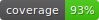

<p align="center"></p>

<h1 align="center">Input Remapper MQTT</h1>

<p align="center">
  <strong>MQTT-based Home Assistant Integration</strong><br/>
  Transform any input device into a Home Assistant controller via MQTT.<br/>
  Map buttons, keys, and inputs to string actions that trigger automations in Home Assistant.
</p>

<p align="center">
  <strong>⚠️ This fork has been modified from the original input-remapper project.</strong><br/>
  Instead of remapping keys to other keys, this version publishes MQTT messages to Home Assistant.
</p>

<p align="center"><a href="readme/usage.md">Usage</a> - <a href="readme/macros.md">Macros</a> - <a href="#installation">Installation</a> - <a href="readme/development.md">Development</a> - <a href="readme/examples.md">Examples</a></p>

<p align="center"> </p>


<p align="center">
  
  &#160;
  
</p>

<br/>

## 🏠 Home Assistant Integration

This version of input-remapper is specifically designed to integrate with Home Assistant via MQTT. When you press a button on your input device (keyboard, remote, game controller, etc.), it publishes an MQTT message to your Home Assistant broker with a custom string action that you define.

### How It Works

1. **Map buttons to strings**: Instead of remapping Button A to Button B, you map Button A to a string like `"toggle_living_room_lights"`
2. **MQTT publishing**: When you press the button, an MQTT message is published to your Home Assistant broker
3. **Home Assistant automation**: Create automations in Home Assistant that trigger on these MQTT messages

### Example Use Cases

- Use a wireless numpad as a Home Assistant scene controller
- Turn an old TV remote into a smart home controller
- Map gamepad buttons to control lights, media, or any Home Assistant entity
- Create custom input devices for elderly or accessibility needs

<br/>

## 📡 MQTT Configuration

### Creating the Configuration File

Create a file at `~/mqtt_config.json` with your MQTT broker settings:

```bash
cp mqtt_config.json.example ~/mqtt_config.json
nano ~/mqtt_config.json
```

**Example configuration:**

```json
{
  "broker": "192.168.1.160",
  "port": 1883,
  "username": "mqttuser",
  "password": "mqttuser",
  "topic": "key_remap/events",
  "qos": 1,
  "retain": false,
  "default_device_name": "living_room_remote"
}
```

### Configuration Fields

| Field | Required | Default | Description |
|-------|----------|---------|-------------|
| `broker` | Yes | - | IP address or hostname of your MQTT broker |
| `port` | Yes | - | MQTT broker port (usually 1883) |
| `username` | Yes | - | MQTT username |
| `password` | Yes | - | MQTT password |
| `topic` | No | `key_remap/events` | MQTT topic to publish to |
| `qos` | No | `1` | MQTT Quality of Service (0, 1, or 2) |
| `retain` | No | `false` | Whether messages should be retained |
| `default_device_name` | No | - | Default device name if not auto-detected |

### MQTT Payload Format

Every button press publishes a JSON message to the configured topic:

```json
{
  "device_name": "living_room_remote",
  "pressed_key": "toggle_govee_m1_small"
}
```

- `device_name`: The name of your input device (auto-detected or from config)
- `pressed_key`: The string action you configured in the UI

<br/>

## 🤖 Home Assistant Setup

### 1. Ensure MQTT Integration is Configured

In Home Assistant, go to **Settings → Devices & Services → MQTT** and ensure your MQTT broker is configured.

### 2. Create an Automation

Create an automation that triggers on MQTT messages. Here's an example:

```yaml
automation:
  - alias: "Living Room Remote - Toggle Lights"
    trigger:
      - platform: mqtt
        topic: "key_remap/events"
    condition:
      - condition: template
        value_template: >
          {{ trigger.payload_json.device_name == "living_room_remote" and
             trigger.payload_json.pressed_key == "toggle_lights" }}
    action:
      - service: light.toggle
        target:
          entity_id: light.living_room

  - alias: "Living Room Remote - Play/Pause"
    trigger:
      - platform: mqtt
        topic: "key_remap/events"
    condition:
      - condition: template
        value_template: >
          {{ trigger.payload_json.device_name == "living_room_remote" and
             trigger.payload_json.pressed_key == "play_pause" }}
    action:
      - service: media_player.media_play_pause
        target:
          entity_id: media_player.living_room_tv
```

### 3. Tips for Automation Design

- **Use descriptive action strings**: Instead of `"btn1"`, use `"toggle_living_room_lights"`
- **Group by device**: Filter by `device_name` to handle multiple remotes
- **Use snake_case**: e.g., `"volume_up"`, `"scene_movie_time"`
- **Test with MQTT Explorer**: Use [MQTT Explorer](http://mqtt-explorer.com/) to verify messages are being published

<br/>

## 🔧 Installation

### Ubuntu/Debian

Either download an installable .deb file from the [latest release](https://github.com/sezanzeb/input-remapper/releases):

```bash
wget https://github.com/sezanzeb/input-remapper/releases/download/2.2.0/input-remapper-2.2.0.deb
sudo apt install -f ./input-remapper-2.2.0.deb
```

Or install the very latest changes via:

```bash
sudo apt install git python3-setuptools gettext
git clone https://github.com/sezanzeb/input-remapper.git
cd input-remapper
./scripts/build.sh
sudo apt purge input-remapper input-remapper-daemon input-remapper-gtk python3-inputremapper
sudo apt install -f ./dist/input-remapper-2.2.0.deb
```

Input Remapper is also available in the repositories of [Debian](https://tracker.debian.org/pkg/input-remapper)
and [Ubuntu](https://packages.ubuntu.com/oracular/input-remapper) via

```bash
sudo apt install input-remapper
```

Input Remapper ≥ 2.0 requires at least Ubuntu 22.04.

<br/>

### Fedora

```bash
sudo dnf install input-remapper
sudo systemctl enable --now input-remapper
```

<br/>

### Arch

```bash
yay -S input-remapper-git
sudo systemctl enable --now input-remapper
```

<br/>

### Other Distros

Figure out the packages providing those dependencies in your distro, and install them:
`python3-evdev` ≥1.3.0, `gtksourceview4`, `python3-devel`, `python3-pydantic`,
`python3-pydbus`, `python3-psutil`, **`python3-paho-mqtt`** _(new requirement for MQTT)_

**⚠️ Important: MQTT Library Installation**

This fork requires `paho-mqtt` for MQTT functionality. Install it using your system's package manager:

```bash
# Debian/Ubuntu (RECOMMENDED)
sudo apt install python3-paho-mqtt

# Arch Linux
sudo pacman -S python-paho-mqtt

# Fedora
sudo dnf install python3-paho-mqtt
```

**Warning about pip**: While you can install paho-mqtt via pip, it's **strongly recommended** to use your system's package manager instead:

- ✅ **Recommended**: `sudo apt install python3-paho-mqtt`
- ⚠️ **Not recommended**: `sudo pip install paho-mqtt`

**Why?** Mixing pip-installed packages with system Python can cause:
- Conflicts with system package managers
- Broken system tools that depend on Python
- Difficult-to-debug dependency issues
- Problems after system updates

If you must use pip (e.g., if the package isn't available for your distro):

```bash
# Only if system package is not available
sudo pip install paho-mqtt evdev pydantic pydbus PyGObject setuptools
```

**Installation steps:**

```bash
git clone https://github.com/Qutaiba-Khader/input-remapper-mqtt.git
cd input-remapper-mqtt
sudo python3 setup.py install
sudo systemctl enable --now input-remapper
```

**After installation:**

1. Create your MQTT config file: `cp mqtt_config.json.example ~/mqtt_config.json`
2. Edit the config: `nano ~/mqtt_config.json`
3. Start the application: `input-remapper-gtk`

<br/>

## 🐛 Debugging and Logs

### Viewing Logs

To see detailed MQTT connection and publishing information:

```bash
# GUI application logs
input-remapper-gtk --debug

# Service logs (where actual MQTT publishing happens)
sudo systemctl status input-remapper
journalctl -u input-remapper -f
```

### Debug Mode

Run the application in debug mode to see detailed logs:

```bash
input-remapper-gtk --debug
```

This will show:
- MQTT connection status and broker details (password hidden)
- Every published event with device_name and pressed_key
- Connection errors with full stack traces
- Handler creation and event pipeline details

### Common Issues

**Problem: "Failed to connect to MQTT broker"**
- Check that your broker IP and port are correct
- Verify username/password are correct
- Test connection: `mosquitto_pub -h 192.168.1.160 -p 1883 -u mqttuser -P mqttuser -t test -m "test"`

**Problem: "MQTT config file not found"**
- Ensure `~/mqtt_config.json` exists
- Copy from example: `cp mqtt_config.json.example ~/mqtt_config.json`

**Problem: "No events being published"**
- Check that you've mapped buttons to string actions in the UI
- Verify the service is running: `sudo systemctl status input-remapper`
- Enable debug logs: `input-remapper-gtk --debug`

**Problem: "ImportError: No module named paho.mqtt"**
- Install paho-mqtt: `sudo apt install python3-paho-mqtt`
- Restart the service: `sudo systemctl restart input-remapper`

### Testing MQTT Publishing

You can test MQTT publishing using an MQTT client like [MQTT Explorer](http://mqtt-explorer.com/) or mosquitto_sub:

```bash
# Subscribe to all events
mosquitto_sub -h 192.168.1.160 -p 1883 -u mqttuser -P mqttuser -t 'key_remap/events' -v
```

Press buttons on your mapped device and you should see messages like:

```
key_remap/events {"device_name": "my_keyboard", "pressed_key": "toggle_lights"}
```

<br/>

## 📝 Usage Notes

### UI Changes

In the mapping editor:
- The "Output Key" field now accepts any string (your MQTT action)
- Instead of selecting a key from a dropdown, type your action string
- Examples: `toggle_lights`, `play_pause`, `scene_movie_night`
- The string you enter will be sent as the `pressed_key` in the MQTT payload

### MQTT Action String Guidelines

- Use lowercase with underscores (snake_case): `toggle_bedroom_lights`
- Be descriptive: `play_pause` is better than `pp`
- Group by function: `light_`, `media_`, `scene_`
- Keep them short but meaningful

### Device Names

The `device_name` in MQTT payloads comes from:
1. The actual device name (auto-detected from the input device)
2. Or the `default_device_name` from your MQTT config

This allows you to have multiple devices publishing to the same topic and distinguish them in Home Assistant automations.

<br/>
