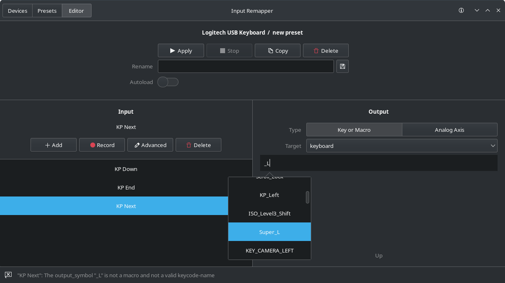

<p align="center"></p>

<h1 align="center">Input Remapper</h1>

<p align="center">
  An easy to use tool to change the behaviour of your input devices.<br/>
  Supports X11, Wayland, combinations, programmable macros, joysticks, wheels,<br/>
  triggers, keys, mouse-movements and more. Maps any input to any other input.
</p>

<p align="center"><a href="readme/usage.md">Usage</a> - <a href="readme/macros.md">Macros</a> - <a href="#installation">Installation</a> - <a href="readme/development.md">Development</a> - <a href="readme/examples.md">Examples</a></p>

<p align="center"> </p>


<p align="center">
  

  
</p>

## Installation

##### Manjaro/Arch

```bash
yay -S input-remapper-git
```

##### Ubuntu/Debian

Get a .deb file from the [release page](https://github.com/sezanzeb/input-remapper/releases)
or install the latest changes via:

```bash
sudo apt install git python3-setuptools gettext
git clone https://github.com/sezanzeb/input-remapper.git
cd input-remapper && ./scripts/build.sh
sudo apt install ./dist/input-remapper-2.0.0-rc.deb
```

input-remapper is available in [Debian](https://tracker.debian.org/pkg/input-remapper)
and [Ubuntu](https://packages.ubuntu.com/jammy/input-remapper)

##### Manual

Dependencies: `python3-evdev` ≥1.3.0, `gtksourceview4`, `python3-devel`, `python3-pydantic`, `python3-pydbus`

Python packages need to be installed globally for the service to be able to import them. Don't use `--user`

Conda can cause problems due to changed python paths and versions.

If it doesn't seem to install, you can also try `sudo python3 setup.py install`

```bash
sudo pip install evdev -U  # If newest version not in distros repo
sudo pip uninstall key-mapper  # In case the old package is still installed
sudo pip install --no-binary :all: git+https://github.com/sezanzeb/input-remapper.git
sudo systemctl enable input-remapper
sudo systemctl restart input-remapper
```

## Migrating old configs to v2

If you want to migrate your beta configs to v2, run

`mv ~/.config/input-remapper/beta_1.6.0-beta ~/.config/input-remapper-2`

If you want to migrate your v1 configs to v2, run

`mv ~/.config/input-remapper/ ~/.config/input-remapper-2`

Then start input-remapper
