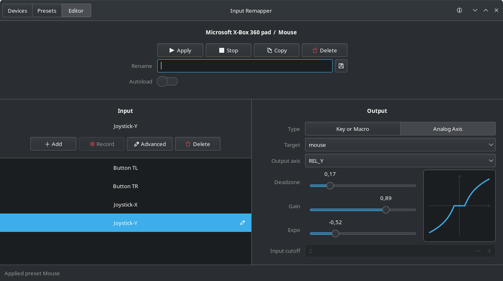

<h1 align="center">Input Remapper</h1>

An easy to use, feature-rich tool to change the behaviour of your input
devices:

 <table style="border-collapse: collapse; border: none;">
  <td>
    <ul>
      <li> Supports <b>X11</b> and <b>Wayland</b>
      <li> Key/button combinations
      <li> Programmable macros
      <li> Wheels
      <li> Triggers
    </ul>
  </td>
  <td>
    <ul>
      <li> Keyboards
      <li> Mouse-movements
      <li> and much more ...
      <li> Maps any input to any other input.
    </ul>
    </td>
</table>

<a href="readme/installation.md">Installation</a>  
<a href="readme/usage.md">Usage</a> - 
<a href="readme/macros.md">Macros</a> - 
<a href="readme/development.md">Development</a> -
<a href="readme/examples.md">Examples</a>

 

  
  &#160;
  

