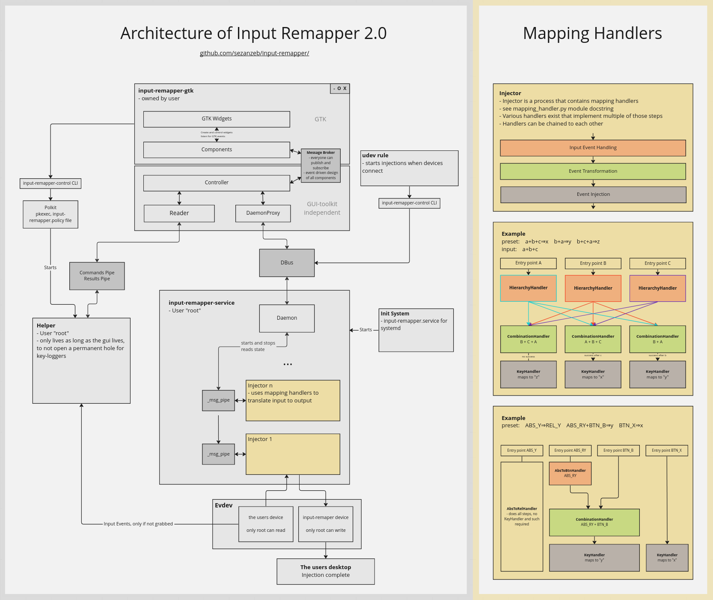

# Development

Contributions are very welcome, I will gladly review and discuss any merge
requests. If you have questions about the code and architecture, feel free
to [open an issue](https://github.com/sezanzeb/input-remapper/issues). This
file should give an overview about some internals of input-remapper.

All pull requests will at some point require unittests (see below for more
info), the code coverage may only be improved, not decreased. It also has to
be mostly compliant with pylint.

## Tests

```bash
pip install coverage --user
pylint inputremapper --extension-pkg-whitelist=evdev
sudo pkill -f input-remapper
sudo pip install . && coverage run tests/test.py
coverage combine && coverage report -m
```

To read events, `evtest` is very helpful. Add `-d` to `input-remapper-gtk`
to get debug output.

Single tests can be executed via

```bash
python3 tests/test.py test_paths.TestPaths.test_mkdir
```

Don't use your computer during integration tests to avoid interacting
with the gui, which might make tests fail.

There is also a run configuration for PyCharm called "All Tests" included.

## Advices

Do not use GTKs `foreach` methods, because when the function fails it just freezes up completely.
Use `get_children()` and iterate over it with regular python `for` loops.

use `gtk_iteration` in tests when interacting with GTK methods to trigger events to be emitted.

## Writing Tests

Tests are in https://github.com/sezanzeb/input-remapper/tree/main/tests

https://github.com/sezanzeb/input-remapper/blob/main/tests/test.py patches some modules and runs tests. The tests need
patches because every environment that runs them will be different. By using patches they all look the same to the
individual tests. Some patches also allow to make some handy assertions, like the `write_history` of `UInput`.

Test files are usually named after the module they are in.

In the tearDown functions, usually one of `quick_cleanup` or `cleanup` should be called. This avoids making a test
fail that comes after your new test, because some state variables might still be modified by yours.

## Releasing

ssh/login into a debian/ubuntu environment

```bash
./scripts/build.sh
```

This will generate `input-remapper/deb/input-remapper-1.6.0-beta.deb`

## Badges

```bash
sudo pip install anybadge pylint
sudo pkill -f input-remapper
sudo pip install .
# the source path in .coveragerc might be incorrect for your system
./scripts/badges.sh
```

New badges, if needed, will be created in `readme/` and they
just need to be commited.

## Architecture

There is a miro board describing input-remappers architecture:

https://miro.com/app/board/uXjVPLa8ilM=/?share_link_id=272180986764



## Resources

- [Guidelines for device capabilities](https://www.kernel.org/doc/Documentation/input/event-codes.txt)
- [PyGObject API Reference](https://lazka.github.io/pgi-docs/)
- [python-evdev](https://python-evdev.readthedocs.io/en/stable/)
- [Python Unix Domain Sockets](https://pymotw.com/2/socket/uds.html)
- [GNOME HIG](https://developer.gnome.org/hig/stable/)
- [GtkSource Example](https://github.com/wolfthefallen/py-GtkSourceCompletion-example)
