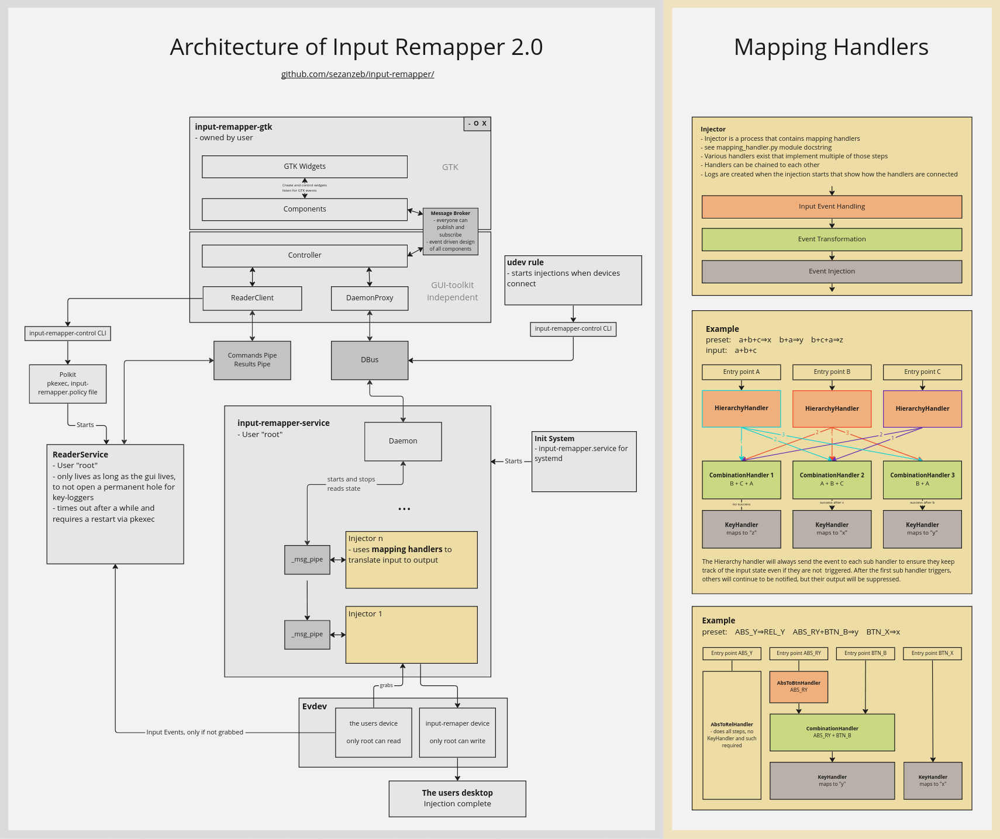

Development
===========

Contributions are very welcome, I will gladly review and discuss any merge requests.
If you have questions about the code and architecture, feel free to
[open an issue](https://github.com/sezanzeb/input-remapper/issues).
This file should give an overview about some internals of input-remapper.

All pull requests will at some point require unittests (see below for more info).
The code coverage may only be improved, not decreased. It also has to be mostly
compliant with pylint.

Running
-------

To quickly restart input-remapper without pkexec prompts, you can use

```bash
sudo pkill -f input-remapper && sudo input-remapper-reader-service -d & sudo input-remapper-service -d & input-remapper-gtk -d
```

To stop an ongoing broken injection, you can try to type `inputremapperpanicquit` if
you can't control your terminal
anymore.

Linting
-------

```bash
mypy inputremapper                  # find typing issues
black .                             # auto-format all code in-place
pip install pylint-pydantic --user  # https://github.com/fcfangcc/pylint-pydantic
pylint inputremapper                # get a code quality rating from pylint
```

Pylint gives lots of great advice on how to write better python code and even detects
errors. Mypy checks for typing errors. Use black to format it.

Automated tests
---------------

You should be able to use your IDEs built in python unittest features to run tests.
But you can also run them from your console:

```bash
pip install psutil  # https://github.com/giampaolo/psutil
pip install -e .
sudo pkill -f input-remapper
python3 -m unittest discover -s ./tests/
```

This assumes you are using your system's `pip`. If you are in a virtual env,
a `sudo pip install` is not recommended. See [Scripts](#scripts) for alternatives.

```
python -m unittest tests/unit/test_daemon.py
python -m unittest tests.unit.test_ipc.TestPipe -k "test_pipe" -f
# See `python -m unittest -h` for more.
```

Don't use your computer during integration tests to avoid interacting with the gui,
which might make tests fail.

To read events for manual testing, `evtest` is very helpful.
Add `-d` to `input-remapper-gtk` to get debug output.

Writing Tests
-------------

Tests are in https://github.com/sezanzeb/input-remapper/tree/main/tests

https://github.com/sezanzeb/input-remapper/blob/main/tests/test.py patches some modules
and runs tests. The tests need patches because every environment that runs them will be
different. By using patches they all look the same to the individual tests. Some
patches also allow to make some handy assertions, like the `write_history` of `UInput`.

Test files are usually named after the module they are in.

In the tearDown functions, usually one of `quick_cleanup` or `cleanup` should be called.
This avoids making a test fail that comes after your new test, because some state
variables might still be modified by yours.

Scripts
-------
To automate some of the development tasks, you can use the
[setup.sh](/scripts/setup.sh) script. The script avoids using `pip` for installation.
Instead, it uses either your local `python3` in your virtual env, or using
`/usr/bin/python3` explicitly. For more information run
```
scripts/setup.sh help
```

Advices
-------

Do not use GTKs `foreach` methods, because when the function fails it just freezes up
completely. Use `get_children()` and iterate over it with regular python `for` loops.
Use `gtk_iteration()` in tests when interacting with GTK methods to trigger events to
be emitted.

Do not do `from evdev import list_devices; list_devices()`, and instead do
`import evdev; evdev.list_devices()`. The first variant cannot be easily patched in
tests (there are ways, but as far as I can tell it has to be configured individually
for each source-file/module). The second option allows for patches to be defiend in
one central places. Importing `KEY_*`, `BTN_*`, etc. constants via `from evdev` is
fine.

Releasing
---------

ssh/login into a debian/ubuntu environment

```bash
scripts/build.sh
```

This will generate `input-remapper/deb/input-remapper-2.0.1.deb`

Badges
------

```bash
# https://github.com/nedbat/coveragepy https://github.com/giampaolo/psutil
pip install coverage anybadge pylint psutil
sudo pkill -f input-remapper
# Make sure input-remapper is uninstalled, then install it editable (without sudo
# should be fine), so that the path for the coverage collection is correct.
# Use `find /usr/ -iname "*inputremapper*"` to check if it is uninstalled.
pip install -e .
./scripts/badges.sh
```

New badges, if needed, will be created in `readme/` and they just need to be commited.

Translations
------------

To regenerate the `po/input-remapper.pot` file, run

```bash
xgettext -k --keyword=translatable --sort-output -o po/input-remapper.pot data/input-remapper.glade
xgettext --keyword=_ -L Python --sort-output -jo po/input-remapper.pot inputremapper/configs/mapping.py inputremapper/gui/*.py inputremapper/gui/components/*.py
```

This is the template file that you can copy to fill in the translations. Also create a
corresponding symlink, like `ln -s it_IT.po it.po`, because some environments expect
different names, apparently. See https://github.com/sezanzeb/input-remapper/tree/main/po
for examples.

Architecture
------------

There is a miro board describing input-remappers architecture:

https://miro.com/app/board/uXjVPLa8ilM=/?share_link_id=272180986764



Resources
---------

- [Guidelines for device capabilities](https://www.kernel.org/doc/Documentation/input/event-codes.txt)
- [PyGObject API Reference](https://lazka.github.io/pgi-docs/)
- [python-evdev](https://python-evdev.readthedocs.io/en/stable/)
- [Python Unix Domain Sockets](https://pymotw.com/2/socket/uds.html)
- [GNOME HIG](https://developer.gnome.org/hig/stable/)
- [GtkSource Example](https://github.com/wolfthefallen/py-GtkSourceCompletion-example)
- [linux/input-event-codes.h](https://github.com/torvalds/linux/blob/master/include/uapi/linux/input-event-codes.h)
- [Screenshot Guidelines](https://www.freedesktop.org/software/appstream/docs/chap-Quickstart.html)
