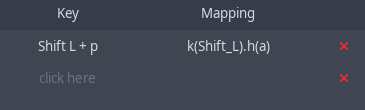

# Usage

To open the UI to modify the mappings, look into your applications menu
and search for 'Key Mapper'. You should be prompted for your sudo password
as special permissions are needed to read events from `/dev/input/` files.
You can also start it via `key-mapper-gtk`.

<p align="center">
  
  
</p>

Hitting a key on the device that is selected in the large dropdown on the top
should display the key on the bottom of the window, and write it into the selected
row (as shown in the screenshots).

In "Mapping", type the key to which you would like to map this key. More information
can be found [below](#key-names-and-macros).

Changes are saved automatically. Afterwards press the "Apply" button.

To change the mapping, you need to use the "Restore Defaults" button, so that
the application can read the original keycode. It would otherwise be
invisible since the daemon maps it independently of the GUI.

## Troubleshooting

If stuff doesn't work, check the output of `key-mapper-gtk -d` and feel free
to [open up an issue here](https://github.com/sezanzeb/key-mapper/issues/new).
Make sure to not post any debug logs that were generated while you entered
private information with your device. Debug logs are quite verbose.

If key-mapper or your presets prevents your input device from working
at all due to autoload, please try to unplug and plug it in twice.
No injection should be running anymore.

## Combinations

Select the key in your row (`click here`) and hold a few buttons down.
Releasing them will make your text cursor jump into the mapping column
to type in what you want to map it to.

Combinations involving Modifiers might not work. Configuring a combination
of two keys to output a single key will require you to push down the first
key, which of course ends up injecting that first key. Then the second key
will trigger the mapping, because the combination is complete. This is
not a bug. Otherwise every combination would have to automatically disable
all keys that are involved in it.

For example a combination of `LEFTSHIFT + a` for `b` would write "B" insetad,
because shift will be activated before you hit the "a". Therefore the
environment will see shift and a "b", which will then be capitalized.

The first option to work around this issue is to use `KP1 + a` instead of
`LEFTSHIFT + a`. You can disable `KP1` by mapping it to `disable`, so you
won't trigger writing a "1" into your focused application.

<p align="center">
  
</p>

The second option is to release the modifier in your combination by writing
the modifier one more time. This will write lowercase "a" characters.

<p align="center">
  
</p>

## Writing Combinations

You can write `Control_L + a` as mapping, which will inject those two
keycodes into your system on a single key press. An arbitrary number of
names can be chained using ` + `.

<p align="center">
  
</p>

## UI Shortcuts

- `ctrl` + `del` stops the injection (only works while the gui is in focus)
- `ctrl` + `q` closes the application
- `ctrl` + `r` refreshes the device list

## Key Names and Macros

Check the autocompletion of the GUI for possible values. You can also
obtain a complete list of possiblities using `key-mapper-control --symbol-names`.

The available symbols depend on the environments keyboard layout. For example,
mapping a key to an exclamation mark is not possible if the keyboard layout is set
to german. However, it is possible to mimic the combination that would be required
to write it, by writing `Shift_L + 1` into the mapping. This is because key-mapper
creates a new virtual keyboard and injects numeric keycodes (with the benefit of being
compatible to all display servers).

Key names that start with `KEY_` are keyboard layout independent constants that might
not result in the expected output. For example using `KEY_Y` would  result in "z"
if the layout of the environment is set to german. Using `y` on the other hand would
correctly result in "y" to be written.

Values for mouse movement and scrolling are actually [macros](macros.md).

See [examples of use](examples.md) for mapping tips for concrete devices
and use cases.

<br/>
<br/>
<br/>
<br/>
<br/>
<br/>

# Advanced

## Configuration Files

If you don't have a graphical user interface, you'll need to edit the
configuration files.

The default configuration is stored at `~/.config/key-mapper/config.json`,
which doesn't include any mappings, but rather other parameters that
are interesting for injections. The current default configuration as of 1.2.1
looks like, with  an example autoload entry:

```json
{
    "autoload": {
        "Logitech USB Keyboard": "preset name"
    },
    "macros": {
        "keystroke_sleep_ms": 10
    },
    "gamepad": {
        "joystick": {
            "non_linearity": 4,
            "pointer_speed": 80,
            "left_purpose": "none",
            "right_purpose": "none",
            "x_scroll_speed": 2,
            "y_scroll_speed": 0.5
        }
    }
}
```

`preset name` refers to `~/.config/key-mapper/presets/device name/preset name.json`.
The device name can be found with `sudo key-mapper-control --list-devices`.

Anything that is relevant to presets can be overwritten in them as well.
Here is an example configuration for preset "a" for the "gamepad" device:
`~/.config/key-mapper/presets/gamepad/a.json`

```json
{
    "macros": {
        "keystroke_sleep_ms": 100
    },
    "mapping": {
        "1,315,1+1,16,-1": "1",
        "1,307,1": "k(2).k(3)"
    }
}
```

Both need to be valid json files, otherwise the parser refuses to work. This
preset maps the EV_KEY down event with code 307 to a macro and sets the time
between injected events of macros to 100 ms. Note that a complete keystroke
consists of two events: down and up. The other mapping is a key combination,
chained using `+`.

Other than that, it inherits all configurations from
`~/.config/key-mapper/config.json`. If config.json is missing some stuff,
it will query the hardcoded default values.

The event codes can be read using `evtest`. Available names in the mapping
can be listed with `key-mapper-control --symbol-names`.

## CLI

**key-mapper-control**

`--command` requires the service to be running. You can start it via
`systemctl start key-mapper` or `sudo key-mapper-service` if it isn't already
running (or without sudo if your user has the appropriate permissions).

Examples:

| Description                                                                                         | Command                                                                               |
|-----------------------------------------------------------------------------------------------------|---------------------------------------------------------------------------------------|
| Load all configured presets for all devices                                                         | `key-mapper-control --command autoload`                                               |
| If you are running as root user, provide information about the whereabouts of the key-mapper config | `key-mapper-control --command autoload --config-dir "~/.config/key-mapper/"`          |
| List available device names for the `--device` parameter                                            | `sudo key-mapper-control --list-devices`                                              |
| Stop injecting                                                                                      | `key-mapper-control --command stop --device "Razer Razer Naga Trinity"`               |
| Load `~/.config/key-mapper/presets/Razer Razer Naga Trinity/a.json`                                 | `key-mapper-control --command start --device "Razer Razer Naga Trinity" --preset "a"` |
| Loads the configured preset for whatever device is using this /dev path                             | `/bin/key-mapper-control --command autoload --device /dev/input/event5`               |

**systemctl**

Stopping the service will stop all ongoing injections

```bash
sudo systemctl stop key-mapper
sudo systemctl start key-mapper
systemctl status key-mapper
```

## Testing your Installation

The following commands can be used to make sure it works:

```bash
sudo key-mapper-service &
key-mapper-control --command hello
```

should print `Daemon answered with "hello"`. And

```bash
sudo key-mapper-control --list-devices
```

should print `Found "...", ...`. If anything looks wrong, feel free to [create
an issue](https://github.com/sezanzeb/key-mapper/issues/new).
