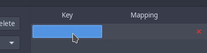
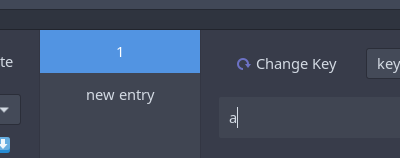
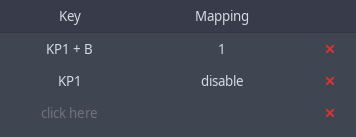
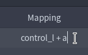

# Usage

To open the UI to modify the mappings, look into your applications menu
and search for 'Key Mapper'. You should be prompted for your sudo password
as special permissions are needed to read events from `/dev/input/` files.
You can also start it via `sudo key-mapper-gtk`.

<p align="center">
  
  
</p>

Hitting a key on the device that is selected in the large dropdown on the top
should display the key on the bottom of the window, and write it into the selected
row (as shown in the screenshots).

For changes to take effect, save the preset first. Otherwise, the daemon
won't be able to know about your changes. Afterwards press the "Apply" button.

To change the mapping, you need to use the "Restore Defaults" button, so that
the application can read the original keycode. It would otherwise be
invisible since the daemon maps it independently of the GUI.

## Troubleshooting

If stuff doesn't work, check the output of `sudo key-mapper-gtk -d` and feel free
to [open up an issue here](https://github.com/sezanzeb/key-mapper/issues/new).
Make sure to not post any debug logs that were generated while you entered
private information with your device. Debug logs are quite verbose.

If injecting stops after closing the window, the service is not running.
Try `sudo systemctl start key-mapper` in a terminal.

If key-mapper or your presets prevents your input device from working
at all due to autoload, please try to replug your device, wait 3 seconds
and replug it again. No injection should be running anymore.

## Combinations

Select the key in your row (`click here`) and hold a few buttons down.
Releasing them will make your text cursor jump into the mapping column
to type in what you want to map it to.

Combinations involving Ctrl might not work, I think the desktop environment
grabs them or something. Combinations with Shift might not work the way
you would expect. If it outputs the keycode for a, you are going to get an
'A', because X11 still sees the enabled shift button.

This happens, because all key-mapper does is either forwarding or mapping
your keycodes (which is easier said than done), and X11/Wayland has to decide
what to do with it. And it decides, that if shift is pressed down, it will
capitalize your stuff.

A better option for a key combination would be `KP1 + a` instead of 
`LEFTSHIFT + a`, because there won't be any side effect. You can disable
`KP1` by mapping it to `disable`, so you won't trigger writing a "1" into
your focused application.

<p align="center">
  
</p>

## Writing Combinations

You can write `control_l + a` as mapping, which will inject those two
keycodes into your system on a single key press. An arbitrary number of
names can be chained using ` + `.

<p align="center">
  
</p>

## Macros

It is possible to write timed macros into the center column:
- `k(1).k(2)` 1, 2
- `r(3, k(a).w(500))` a, a, a with 500ms pause
- `m(Control_L, k(a).k(x))` CTRL + a, CTRL + x
- `k(1).h(k(2)).k(3)` writes 1 2 2 ... 2 2 3 while the key is pressed

Documentation:
- `r` repeats the execution of the second parameter
- `w` waits in milliseconds
- `k` writes a single keystroke
- `m` holds a modifier while executing the second parameter
- `h` executes the parameter as long as the key is pressed down
- `.` executes two actions behind each other

Syntax errors are shown in the UI on save. Each `k` function adds a short
delay of 10ms between key-down, key-up and at the end. See
[Configuration Files](#configuration-files) for more info.

Bear in mind that anti-cheat software might detect macros in games.

## Key Names

Check the autocompletion of the GUI for possible values. You can also
obtain a complete list of possiblities using `key-mapper-control --key-names`.
Examples:

- Alphanumeric `a` to `z` and `0` to `9`
- Modifiers `Alt_L` `Control_L` `Control_R` `Shift_L` `Shift_R`
- Mouse buttons `BTN_LEFT` `BTN_RIGHT` `BTN_MIDDLE` `BTN_SIDE` ...
- Multimedia keys `KEY_NEXTSONG` `KEY_PLAYPAUSE` ...

## Gamepads

Joystick movements will be translated to mouse movements, while the second
joystick acts as a mouse wheel. You can swap this in the user interface.
All buttons, triggers and D-Pads can be mapped to keycodes and macros.

The D-Pad can be mapped to W, A, S, D for example, to run around in games,
while the joystick turns the view (depending on the game).

Tested with the XBOX 360 Gamepad. On Ubuntu, gamepads worked better in
Wayland than with X11 for me.

<br/>
<br/>
<br/>
<br/>
<br/>
<br/>

# Advanced

You usually don't need the stuff described here, you can configure everything
via the gui as well.

If you have trouble mapping some keys because the gui loses focus, or
if you don't have a graphical user interface, you'll need to edit the
configuration files.

## Configuration Files

The default configuration is stored at `~/.config/key-mapper/config.json`.
The current default configuration as of 0.6.1 looks like, with
an example autoload entry:

```json
{
    "autoload": {
        "Logitech USB Keyboard": "preset name"
    },
    "macros": {
        "keystroke_sleep_ms": 10
    },
    "gamepad": {
        "joystick": {
            "non_linearity": 4,
            "pointer_speed": 80,
            "left_purpose": "mouse",
            "right_purpose": "wheel",
            "x_scroll_speed": 2,
            "y_scroll_speed": 0.5
        }
    }
}
```

`preset name` refers to `~/.config/key-mapper/presets/device name/preset name.json`.
The device name can be found with `sudo key-mapper-control --list-devices`.

Anything that is relevant to presets can be overwritten in them as well.
Here is an example configuration for preset "a" for the "gamepad" device:
`~/.config/key-mapper/presets/gamepad/a.json`

```json
{
    "macros": {
        "keystroke_sleep_ms": 100
    },
    "mapping": {
        "1,315,1+1,16,-1": "1",
        "1,307,1": "k(2).k(3)"
    }
}
```

Both need to be valid json files, otherwise the parser refuses to work. This
preset maps the EV_KEY down event with code 307 to a macro and sets the time
between injected events of macros to 100 ms. The other mapping is a key
combination, chained using `+`. 

Note that a complete keystroke consists of two events: down and up. Other
than that, it inherits all configurations from
`~/.config/key-mapper/config.json`. If config.json is missing some stuff,
it will query the hardcoded default values.

The event codes can be read using `evtest`. Available names in the mapping
can be listed with `key-mapper-control --key-names`.

## CLI

**key-mapper-control**

`--command` requires the service to be running. You can start it via
`systemctl start key-mapper` or `sudo key-mapper-service` if it isn't already
running (or without sudo if your user has the appropriate permissions).

Examples:

```bash
key-mapper-control --command autoload
# if you are running as root user, provide information about the whereabouts of the key-mapper config:
key-mapper-control --command autoload --config-dir "/home/user/.config/key-mapper/"
sudo key-mapper-control --list-devices
key-mapper-control --command stop --device "Razer Razer Naga Trinity"
# load ~/.config/key-mapper/presets/Razer Razer Naga Trinity/a.json:
key-mapper-control --command start --device "Razer Razer Naga Trinity" --preset "a"
```

**systemctl**

Stopping the service will stop all injections until the computer is rebooted.

```bash
sudo systemctl stop key-mapper
sudo systemctl start key-mapper
systemctl status key-mapper
```

## Testing your Installation

The following commands can be used to make sure it works:

```bash
sudo key-mapper-service &
key-mapper-control --command hello
```

should print `Daemon answered with "hello"`. And

```bash
sudo key-mapper-control --list-devices
```

should print `Found "...", ...`. If anything looks wrong, feel free to [create
an issue](https://github.com/sezanzeb/key-mapper/issues/new).
